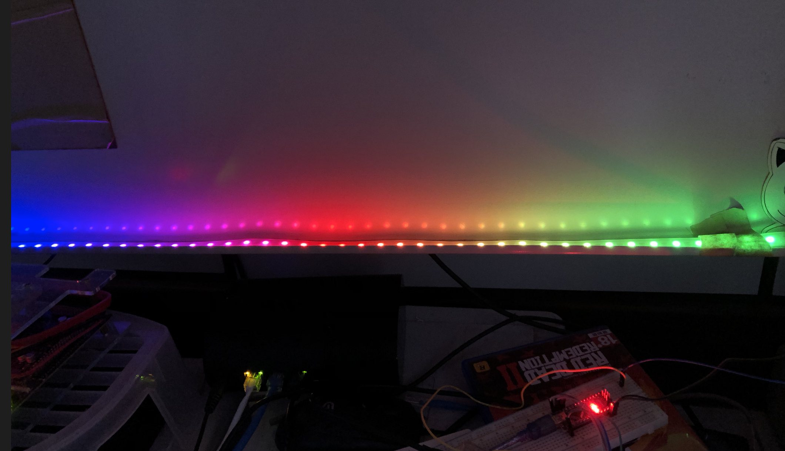

# homekit-neopixel-rpi
homekit-neopixel-rpi 




## You need

Hardware:

​	Raspberry Pi

​	Neopixel

Software

​	homebridge on Raspberry Pi


### Install 

```
sudo npm install -g homebridge-neopixel --unsafe-perm
```


### setting
```
# .homebridge/config
# add 
{     "accessory": "HTTP-NEO",
        "name": "Neo Lamp",

        "switch": {
        "status": "http://localhost:5000/status",
        "powerOn": "http://localhost:5000/on",
        "powerOff": "http://localhost:5000/off"
        },

        "color": {
        "status": "http://localhost:5000/color",
        "url": "http://localhost:5000/set/%s"
        },

        "brightness": {
        "status": "http://localhost:5000/bright",
        "url": "http://localhost:5000/set/%s"
        }
```

```python
sudo FLASK_APP=server.py flask run
```


(homebridge neopixel)[https://www.studiopieters.nl/homebridge-neopixel-light/]
(RPi neipixel)[https://learn.adafruit.com/neopixels-on-raspberry-pi/raspberry-pi-wiring]